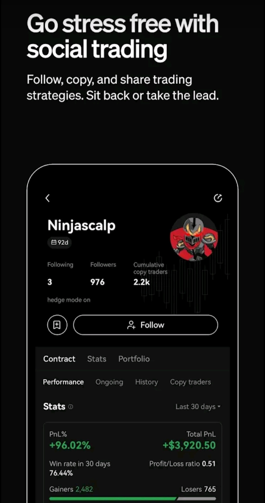

# Buy Bitcoin & Crypto: Your Complete Guide to Getting Started

Looking to buy Bitcoin or other cryptocurrencies but not sure where to start? Whether you're dipping your toes into digital assets for the first time or searching for a more reliable trading platform, understanding how to purchase crypto safely and efficiently can save you time, money, and headaches. This guide walks you through the essentials of buying Bitcoin and crypto, highlighting what matters most: lower fees, better security, and a smoother user experience.

---

## Why People Are Turning to Crypto Exchanges Like OKX

So here's the thing about buying Bitcoin these days. It used to feel like you needed a computer science degree just to figure out where to click. Now? Platforms have gotten smarter about making things actually accessible to regular people.

The main appeal comes down to a few practical points. First, you want your money to be safe—that's obvious. Second, you don't want to get nickel-and-dimed with crazy fees every time you make a move. And third, you want the whole process to not feel like solving a puzzle.

That's where centralized exchanges come in handy. They handle the complicated stuff in the background while you focus on what matters: buying, holding, or trading your crypto.

## What Makes a Good Crypto Buying Experience?

You know what's funny? People overthink this part. It's not rocket science—you just need a platform that does the basics really well.

**Security first.** Your crypto should be as locked down as your bank account. Two-factor authentication, cold storage for most funds, insurance policies—these aren't nice-to-haves anymore, they're table stakes.

**Reasonable fees.** Some exchanges act like they're doing you a favor by charging you an arm and a leg for every transaction. The good ones? They keep fees competitive because they know you have options.

**Actual variety.** Sure, Bitcoin is the big name, but what if you want to explore Ethereum, Solana, or some smaller projects? A solid exchange gives you room to explore without forcing you to jump through hoops.

👉 [Ready to start buying crypto with better rates and security? Check out what OKX offers](https://www.okx.com/join/47044926)

## Breaking Down the Buying Process

Let me walk you through what actually happens when you decide to buy Bitcoin or any other crypto. It's simpler than it sounds.

**Step one: Sign up and verify.** Yeah, you'll need to provide some ID. I know, nobody loves this part, but it's how exchanges keep things legitimate and protect everyone involved. Takes maybe ten minutes if you have your documents handy.

**Step two: Fund your account.** Most platforms let you deposit money via bank transfer, debit card, or credit card. Bank transfers usually have lower fees but take a day or two. Cards are instant but cost a bit more. Pick what works for your situation.

**Step three: Make your purchase.** This is the easy part. You literally just select Bitcoin (or whatever crypto you want), enter how much you want to buy, and confirm. Done.

**Step four: Decide where to keep it.** You can leave it in your exchange wallet for convenience, or transfer it to a personal wallet if you're the cautious type. Both have their place depending on what you're doing with your crypto.

## Common Questions People Actually Ask

**"Do I need to buy a whole Bitcoin?"** Nope. You can buy a fraction—like $50 worth, or even $10 worth if that's what makes sense for you. Bitcoin is divisible down to eight decimal places, so you're not locked into some huge minimum purchase.

**"How fast can I actually start trading?"** If you use a card, pretty much immediately after verification. Bank transfers take longer to process but you'll have your funds within a couple business days at most.

**"What about fees?"** They vary by platform and payment method. Generally speaking, bank transfers have the lowest fees, cards cost more, and peer-to-peer methods fall somewhere in between. Always check the fee structure before you commit to a purchase.

**"Is it safe to keep crypto on an exchange?"** For smaller amounts that you might trade or use regularly, sure. For larger amounts you're planning to hold long-term, you might want to move it to a hardware wallet. It's all about balancing convenience with security based on your needs.

## Beyond Just Bitcoin: Exploring Other Cryptocurrencies

Bitcoin gets all the headlines, but here's something interesting—there's a whole ecosystem of other cryptocurrencies worth knowing about.

Ethereum is the second-biggest by market cap and powers a ton of decentralized applications. Stablecoins like USDT or USDC are pegged to the dollar, which makes them useful for moving money around without volatility. Then you've got projects like Solana, Cardano, and Polkadot doing their own thing with different approaches to blockchain technology.

The point isn't to overwhelm you with options. It's just that having access to a diverse range of assets gives you flexibility. Maybe you start with Bitcoin and later decide you want to explore DeFi or NFTs. Having everything in one place makes that transition smoother.

## What to Look for in a Crypto Exchange

When you're comparing platforms, keep these factors in mind:

**User experience matters more than you think.** A clunky interface turns simple tasks into frustrating ordeals. Look for clean design, intuitive navigation, and responsive customer support when you need it.

**Liquidity affects your trading.** Higher liquidity means you can buy or sell quickly at fair prices without huge spreads. Larger exchanges typically have better liquidity, which translates to better execution for you.

**Educational resources help you level up.** The crypto space evolves quickly. Platforms that offer tutorials, market analysis, and learning materials show they care about helping users make informed decisions rather than just extracting fees.

**Mobile access is pretty much essential.** Whether you're checking prices on the go or need to make a quick trade, having a solid mobile app means you're not tied to your desktop.

## Making Your First Purchase: A Reality Check

Look, buying your first Bitcoin or crypto can feel like a big step. That's normal. Here's what actually helps: start small. Seriously, there's no rule saying you need to dive in with thousands of dollars. Buy $50 worth, see how it feels, watch the price move around for a week, and get comfortable with the process.

Once you've done it once, the mystery disappears. You realize it's just technology facilitating a transaction, no different from buying stocks or transferring money online. The interface might look different, but the fundamentals are familiar.

And here's the thing people don't talk about enough—timing doesn't matter as much as you think when you're starting out. Sure, buying at local lows is great, but consistently participating in the market over time tends to smooth out those short-term fluctuations anyway. Start when you're ready, not when someone on Twitter says it's the perfect moment.

---

## Wrapping It Up

Buying Bitcoin and crypto doesn't need to be complicated. Find a platform that treats security seriously, offers reasonable fees, and makes the user experience straightforward rather than overwhelming. Focus on understanding the basics first—how to buy, how to store, how to manage risk—before worrying about advanced trading strategies or chasing moonshots.

The crypto landscape keeps evolving, but the core principles stay consistent: do your research, don't invest more than you can afford to lose, and use reputable platforms that prioritize user protection. Whether you're interested in Bitcoin as digital gold, Ethereum for its smart contract capabilities, or just want exposure to this growing asset class, having the right exchange matters. That's why platforms like OKX make sense for both newcomers and experienced traders looking for a reliable place to buy, sell, and manage cryptocurrency with better rates and stronger security features. 👉 [Get started with code 47044926](https://www.okx.com/join/47044926)
